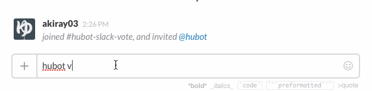

# hubot-slack-vote



see: http://qiita.com/akiray03/items/e649212d7749413365bd

A hubot script that does the things

See [`src/hubot-slack-vote.coffee`](src/hubot-slack-vote.coffee) for full documentation.

## Installation

In hubot project repo, run:

`npm install hubot-slack-vote --save`

Then add **hubot-slack-vote** to your `external-scripts.json`:

```json
["hubot-slack-vote"]
```

## Sample Interaction

```
user1>> hubot vote :dog: :cat:
```
